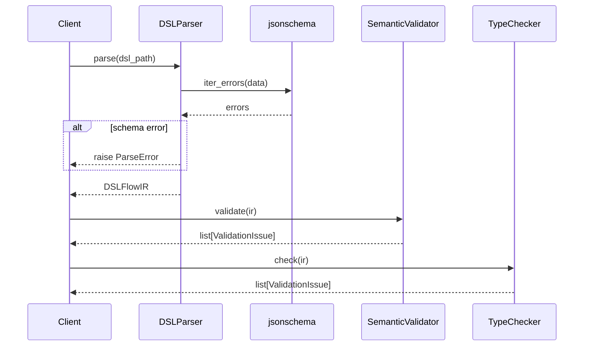
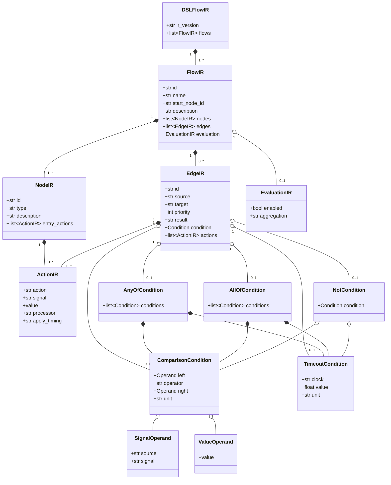
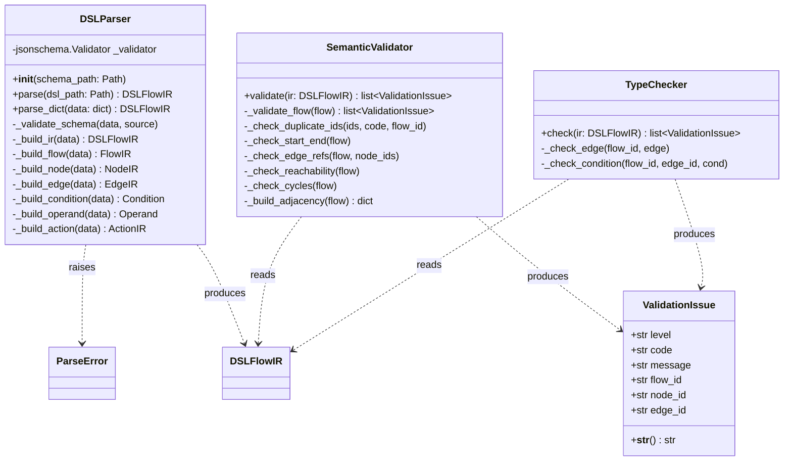
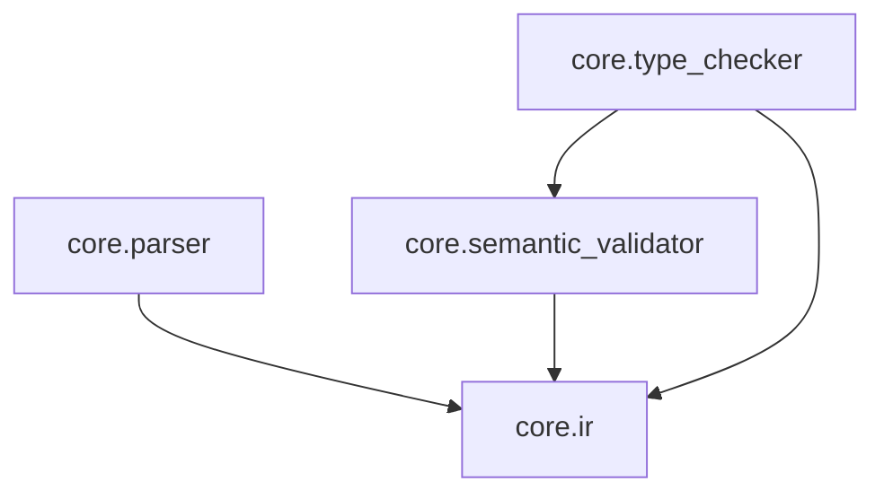

# 09. Core Design — Phase 2

## 1. 処理フロー概要

```text
JSON ファイル / dict
      │
      ▼
┌─────────────┐   ParseError
│  DSLParser  │──────────────▶ 例外送出
└─────────────┘
      │ DSLFlowIR
      ▼
┌──────────────────┐   ValidationIssue[]
│ SemanticValidator│──────────────────▶ error / warning
└──────────────────┘
      │ DSLFlowIR（構造は変わらない）
      ▼
┌─────────────┐   ValidationIssue[]
│ TypeChecker │──────────────────▶ error / warning
└─────────────┘
      │ DSLFlowIR
      ▼
  Backend Adapter（Phase 3 以降）
```

---

## 2. シーケンス図



---

## 3. クラス図 — IR モデル



---

## 4. クラス図 — Core モジュール



---

## 5. Semantic Validator 検証ルール一覧

| コード | レベル | 検証内容 |
|---|---|---|
| `DUPLICATE_NODE_ID` | error | `node.id` の重複 |
| `DUPLICATE_EDGE_ID` | error | `edge.id` の重複 |
| `NO_START_NODE` | error | `start` node が存在しない |
| `MULTIPLE_START_NODES` | error | `start` node が複数存在する |
| `NO_END_NODE` | error | `end` node が存在しない |
| `INVALID_EDGE_SOURCE` | error | `edge.source` が存在しない node を参照している |
| `INVALID_EDGE_TARGET` | error | `edge.target` が存在しない node を参照している |
| `UNREACHABLE_NODE` | warning | `start` node から到達不能な node がある |
| `POSSIBLE_CYCLE` | warning | フロー内に循環（無限ループ）の可能性がある |

error がある場合、到達性・循環検出は実行しない（グラフが壊れているため）。

---

## 6. Type Checker 検証ルール一覧

| コード | レベル | 検証内容 |
|---|---|---|
| `INVALID_RESULT` | error | `edge.result` が許可値以外 |
| `INVALID_OPERATOR` | error | `comparison.operator` が許可値以外 |
| `INVALID_CLOCK` | error | `timeout.clock` が許可値以外 |
| `INVALID_UNIT` | error | `timeout.unit` が許可値以外 |

---

## 7. モジュール依存関係



`type_checker` は `ValidationIssue` を `semantic_validator` から再利用している。  
`parser` / `semantic_validator` / `type_checker` は互いに依存しない。

---

## 8. ディレクトリ構成

```text
src/core/
├─ __init__.py
├─ ir/
│  ├─ __init__.py        # 公開 API エクスポート
│  └─ models.py          # IR データクラス定義
├─ parser/
│  ├─ __init__.py
│  └─ dsl_parser.py      # DSLParser / ParseError
├─ semantic_validator/
│  ├─ __init__.py
│  └─ validator.py       # SemanticValidator / ValidationIssue
└─ type_checker/
   ├─ __init__.py
   └─ checker.py         # TypeChecker

tests/core/
├─ test_parser.py        # 11 テスト
├─ test_semantic_validator.py  # 11 テスト
└─ test_type_checker.py  # 7 テスト
```
